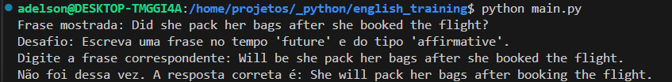
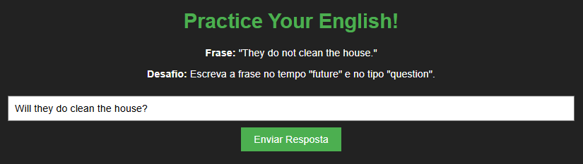

# English Training
Este projeto simples feito com o objetivo de ser uma ferramenta para facilitar o treino de tempos verbais com frases em inglês.

## Formato
Este projeto contempla 60 objetos de frases em inglês, cada objeto é composto por 9 variações de frases nos tempos passado, presente e futuro, nos tipos, pergunta, afirmação e negação.

Aqui temos um exemplo do formato do objeto de frase, cada objeto é constituído no total por 9 variações de uma frase.
```json
{
        "past": {
            "question": "Did they cook dinner?",
            "affirmative": "They cooked dinner.",
            "negative": "They did not cook dinner."
        },
        "present": {
            "question": "Do they cook dinner?",
            "affirmative": "They cook dinner.",
            "negative": "They do not cook dinner."
        },
        "future": {
            "question": "Will they cook dinner?",
            "affirmative": "They will cook dinner.",
            "negative": "They will not cook dinner."
        }
    }
```
## Fluxo
O sistema tem um fluxo simples.

1. Selecionar um objeto de frase na base de dados.
2. Selecionar uma frase entre às 9 do objeto para mostrar ao usuário.
3. Selecionar uma frase entre às 9 como desafio para o usuário inserir e testar o conhecimento.
4. Feedback informando acerto ou erro, em caso de erro mostrando a frase correta.

## Como usar o projeto
O projeto foi feito em duas linguagens, Python e JavaScript, então é possível rodar o projeto em um terminal usando o comando.
```sh
python main.py
```
Ou rodar usando o navegador com de preferência com um servidor web.

## Acesso on-line
É possível usar o sistema on-line no seguinte endereço:
> https://adelsonguimaraes.github.io/english_training/web/

## Preview pyhton


## Preview web
